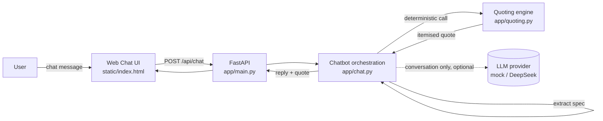

# SteelDoorAi Demo

An AI-assisted quoting assistant and chatbot demo for a steel / security / fire door business.

This project demonstrates **AI software development and integrations**: a natural-language chatbot front end that drives a **deterministic, auditable quoting engine**, exposed over a small FastAPI service with a browser UI.

> **Note on data:** All product, pricing, and fire-rating values in this repo are **realistic placeholders** marked `TODO: replace with real pricing`. Replace them with the real price list before using for anything real.

---

## Build story

- **Project:** SteelDoorAi-demo
- **Built by:** Kieran
- **Co-author:** GitLab Duo
- **Created:** 2026-06-10 (UTC)

**Workflow used to build this:**

1. **Direction & requirements** - Kieran
2. **Scaffolding & code generation** - GitLab Duo
3. **Local development** - VS Code
4. **Skill / quality audit pass** - DeepSeek
5. **Final polish pass** - Opus / Fable

The full scaffold (backend, quoting engine, chatbot, web UI, tests, CI) was generated in a single pass to show how quickly a clean, testable foundation can be stood up.

---

## Features

- **Deterministic quoting engine** (`app/quoting.py`) - transparent, rule-based pricing by dimensions, material, fire rating, finish, and quantity. No AI-guessed prices; the math is auditable.
- **Chatbot** (`app/chat.py`) - natural-language intake that extracts requirements and calls the quoting engine. Runs out of the box with a **mock responder** (no API key needed). Pluggable real LLM (e.g. DeepSeek) via environment variable.
- **Web chat UI** (`app/static/`) - simple, clean, browser-based; easy to demo.
- **REST API** (`app/main.py`) - `/api/quote` and `/api/chat` endpoints.
- **Tests** (`tests/`) - pytest covering the quoting math, NL extraction, and the API endpoints.
- **CI** (`.gitlab-ci.yml`) - installs dependencies and runs the test suite.
- **Dockerfile** + **Makefile** - one-command demo and containerised run.

---

## Architecture



**Design principle:** the LLM only handles conversation. All prices come from the deterministic engine, so quotes are correct, repeatable, and auditable.

---

## Quick start

```bash
git clone <repo-url>
cd steeldoorai-demo
python -m venv .venv
source .venv/bin/activate   # Windows: .venv\\Scripts\\activate
pip install -r requirements.txt
uvicorn app.main:app --reload
```

Then open http://localhost:8000 in your browser and chat with the assistant.

### Run the tests

```bash
pytest
```

### Shortcuts (Makefile)

```bash
make install   # create venv + install deps
make test      # run pytest
make demo      # run the server with reload
```

### Run with Docker

```bash
docker build -t steeldoorai .
docker run -p 8000:8000 steeldoorai
# open http://localhost:8000
```

---

## Using a real LLM (optional)

The chatbot works fully without any API key using a built-in mock responder. To use a real model:

1. Copy `.env.example` to `.env`.
2. Set `LLM_PROVIDER=deepseek` and `DEEPSEEK_API_KEY=...`.

With no key set, `LLM_PROVIDER` defaults to `mock` so the demo always runs.

---

## Hand off to Claude / VS Code

Clone the repo, open it in VS Code, then paste this prompt to Claude to get it running:

> This is a FastAPI steel-door quoting demo. Read `README.md` and `RECOMMENDATIONS.md`.
> The quoting logic is in `app/quoting.py` (placeholder prices marked TODO), chatbot
> orchestration in `app/chat.py`, the API in `app/main.py`, and the web UI in
> `app/static/index.html`. Set up a virtual environment, install `requirements.txt`,
> run `pytest`, then start the server with `uvicorn app.main:app --reload` and confirm
> http://localhost:8000 works. Do not change the deterministic quoting logic - the LLM
> must never produce prices, only conversation.

```bash
git clone https://gitlab.com/dankstuido-group/steeldoorai-demo.git
cd steeldoorai-demo
code .
```

---

See [PROJECT_SUMMARY.md](PROJECT_SUMMARY.md) for an at-a-glance overview and a prioritised
further-upgrade backlog, and [RECOMMENDATIONS.md](RECOMMENDATIONS.md) for the business-facing AI roadmap.
